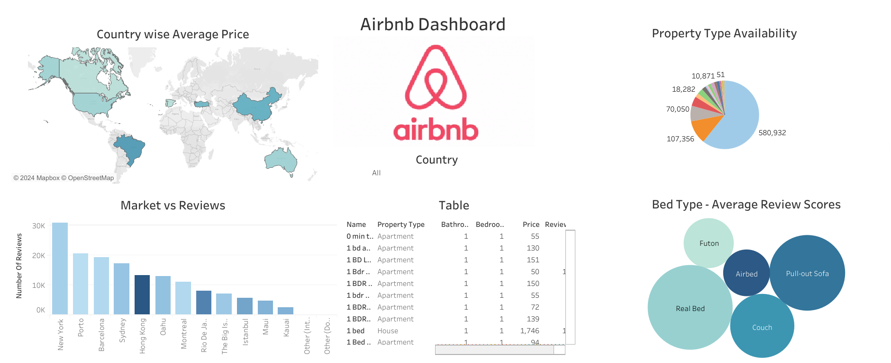

# Airbnb_Analysis


## Overview
This repository contains a Python script for analyzing Airbnb data using MongoDB Atlas, performing data cleaning, and developing interactive geospatial visualizations. The project aims to provide insights into pricing variations, availability patterns, and location-based trends in Airbnb listings.

## Technologies Used
- Streamlit
- Pandas
- Plotly
- Folium
- MongoDB Atlas

## Workflow Execution
1. Clone the repository
2. Install the required packages
3. Connect to MongoDB Atlas and retrieve the Airbnb Dataset
4. Clean the dataset using Preprocessing steps
5. Store the dataset in the CSV format
6. Run the Streamlit web application
    ```bash
    streamlit run main.py
    ```
7. Explore the interactive web application and gain insights into Airbnb data
8. Create a Tableau Dashboard on the Airbnb dataset

## Airbnb Dashboard


